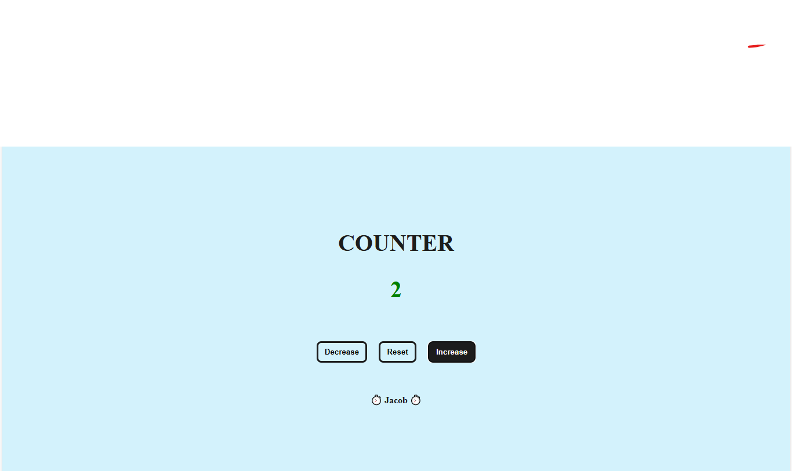

# Counter

<h1>Simple counter project using HTML, CSS and Javascript</h1>

## Table of contents

- [Overview](#overview)
  - [Screenshot](#screenshot)
  - [Link](#link)
- [My process](#my-process)
  - [Built with](#built-with)
  - [Useful resources](#useful-resources)
- [Author](#author)

## Overview

### Screenshot

### Link
- Live Site URL: [javascript number counter](https://guileless-duckanoo-5c3f8b.netlify.app/)

## My process

### Built with

- Semantic HTML5 markup
- CSS custom properties
- Javascript

### Useful resources

- [21 Javascript projects for beginners](https://www.freecodecamp.org/news/javascript-projects-for-beginners).

## Author

- Twitter - [@jacobxavier\_](https://twitter.com/jacobxavier_)
